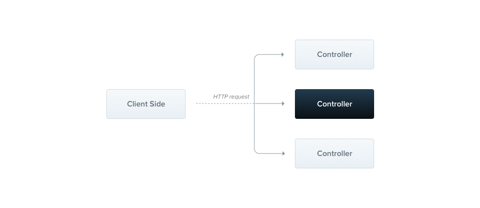

# Express Controllers  
* Controllers are responsible for handling incoming requests and returning responses to the client.
* Controls the logic behind each router routing an endpoint.
to make the codebase readable and maintainable 
e.g make a request that call the database when a particular endpoint is hit.

